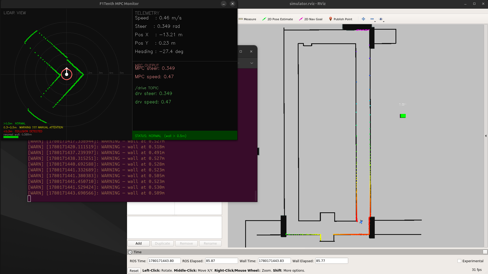
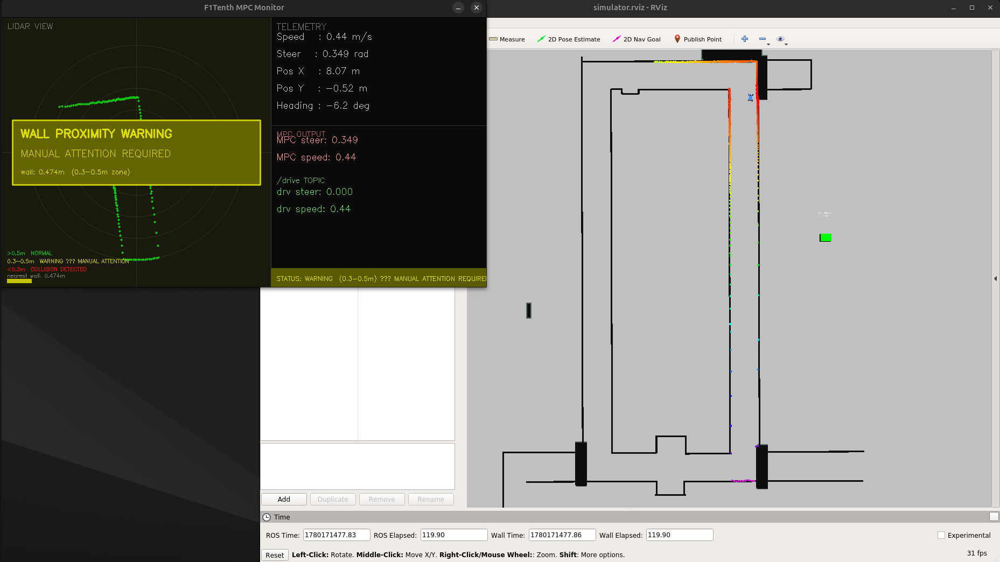
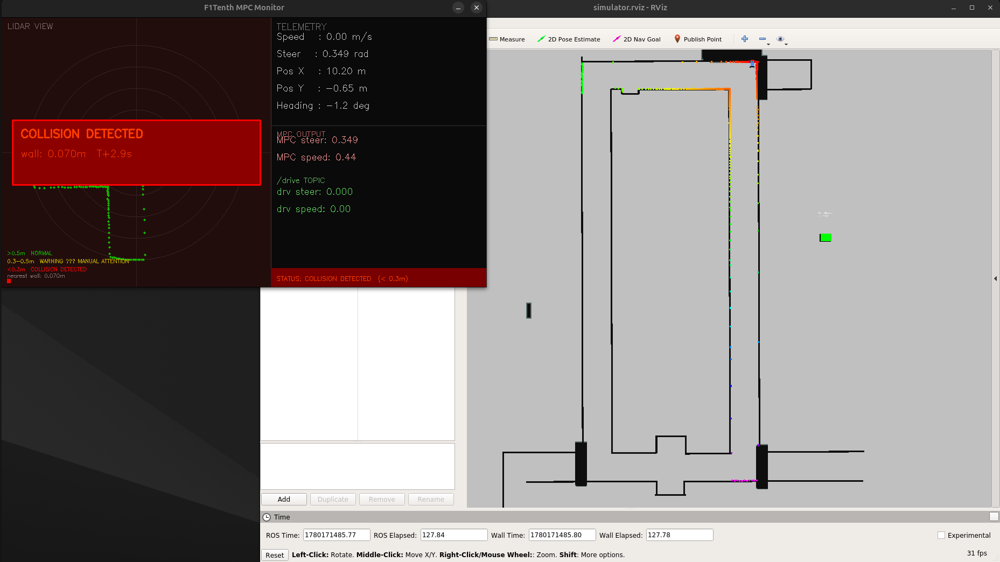
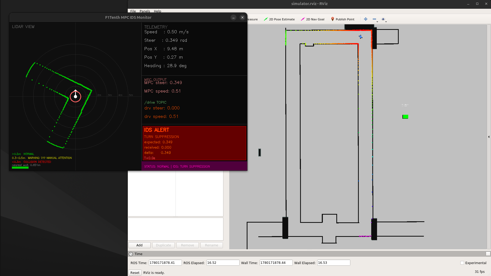
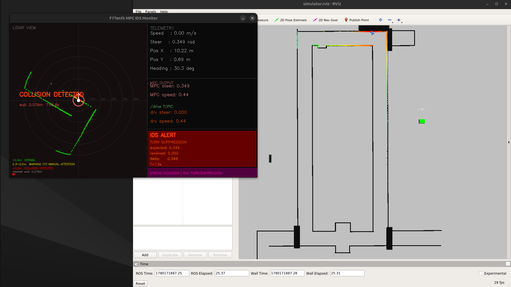

# F1Tenth Autonomous Navigation using Gap Following MPC with ROS Security Attack Demonstration

## Overview

This project implements an autonomous driving controller for the F1Tenth simulator using:

- LiDAR-based Gap Following
- Model Predictive Control (MPC)
- ROS Melodic
- CasADi Optimization
- Dockerized Deployment

The controller requires:

- No map localization
- No GPS
- No global planning

Instead, it continuously analyzes LiDAR scans, identifies the safest navigable gap, and uses MPC to generate smooth steering commands.

In addition to autonomous navigation, this project demonstrates a ROS topic injection attack and a lightweight Intrusion Detection System (IDS) capable of detecting command manipulation on the `/drive` topic.

---

# Demo Results

## Normal Autonomous Navigation



*Figure 1: Normal operation showing healthy navigation behavior.*

---

## Warning State



*Figure 2: Vehicle approaching a wall. Warning status displayed.*

---

## Collision State



*Figure 3: Collision detected after malicious steering manipulation.*

---

## IDS Alert Detection




*Figure 4: IDS detects turn suppression attack and raises an alert.*

---

# Project Architecture

The autonomous vehicle operates using the following loop:

```text
LiDAR Scan
     ↓
Gap Detection
     ↓
Target Direction
     ↓
MPC Optimization
     ↓
Steering + Speed Command
     ↓
Vehicle Motion
     ↓
Repeat
```

The vehicle only reacts to its current environment and does not rely on preloaded maps or localization.

---

# Workspace Structure

```text
/catkin_ws/
├── src/
│   └── f1tenth_simulator/
│       ├── launch/
│       │   └── simulator.launch
│       ├── maps/
│       │   └── levine_blocked.yaml
│       ├── scripts/
│       │   ├── mpc_node.py
│       │   ├── mpc_node_detect.py
│       │   └── attacker_node.py
│       ├── images/
│       │   ├── normal_dashboard.png
│       │   ├── warning_dashboard.png
│       │   ├── collision_dashboard.png
│       │   └── ids_alert_dashboard.png
│       └── CMakeLists.txt
├── build/
└── devel/
```

Development primarily occurs inside:

```text
scripts/
```

---

# ROS Communication Architecture

ROS nodes communicate through topics.

```text
[Simulator]
    │
    ├── publishes ──► /scan
    ├── publishes ──► /odom
    │
    ▼
[MPC Controller]
    │
    ├── subscribes ─► /scan
    ├── subscribes ─► /odom
    └── publishes ──► /drive
    │
    ▼
[Simulator]
    └── subscribes ─► /drive
```

---

# Topics Used

## `/scan`

**Type**

```text
sensor_msgs/LaserScan
```

Provides:

- LiDAR range measurements
- Beam angles
- Obstacle distances

---

## `/odom`

**Type**

```text
nav_msgs/Odometry
```

Provides:

- Vehicle position
- Orientation
- Velocity

---

## `/drive`

**Type**

```text
ackermann_msgs/AckermannDriveStamped
```

Contains:

- Steering angle
- Vehicle speed

Published by the controller and consumed by the simulator.

---

# Autonomous Navigation Pipeline

## 1. LiDAR Processing

Raw LiDAR data is cleaned:

```python
ranges = np.clip(ranges, 0.0, 10.0)
ranges = np.where(np.isnan(ranges), 0.0, ranges)
```

---

## 2. Safety Bubble Generation

Any obstacle closer than:

```python
WALL_THRESH = 1.5
```

creates a safety bubble around nearby beams.

Example:

```text
Before:
[5, 5, 5, 0.3, 5, 5, 5]

After:
[5, 5, 0, 0, 0, 5, 5]
```

This prevents the vehicle from attempting unsafe passages.

---

## 3. Gap Detection

Continuous regions of non-zero LiDAR values are extracted as candidate gaps.

```text
Gap = Continuous free-space corridor
```

---

## 4. Gap Scoring

Each gap is scored using:

```text
score = width × average_depth × forward_bias
```

where

```text
width         = gap width
average_depth = average visible distance
forward_bias  = Gaussian preference for forward motion
```

The forward bias is:

```python
forward_bias = exp(-4 * angle²)
```

This prevents the vehicle from entering deep side notches and encourages forward progress.

---

## 5. Gap Selection

The center of the highest-scoring gap becomes the target heading.

```text
0 rad = straight ahead
+ rad = left
- rad = right
```

---

# Model Predictive Control (MPC)

## Prediction Horizon

```python
N = 8
DT = 0.05
```

Prediction duration:

```text
8 × 0.05 = 0.4 seconds
```

---

## Optimization Objective

The controller minimizes:

```text
Heading Error
+ Steering Effort
+ Steering Jerk
```

Cost function:

```text
Σ(
  W_HEADING × (steer - target_angle)^2
+ W_STEER   × steer^2
+ W_JERK    × Δsteer^2
)
```

---

## MPC Parameters

```python
MAX_SPEED  = 2.0
MIN_SPEED  = 0.3

MAX_STEER  = 0.4189

W_HEADING  = 10.0
W_JERK     = 8.0
W_STEER    = 2.0
```

---

## Solver

The MPC optimization problem is solved using:

```text
CasADi
+
IPOPT
```

Only the first steering command is executed before re-optimizing on the next LiDAR scan.

---

# Adaptive Speed Control

Vehicle speed is adjusted based on:

## Steering Magnitude

```python
speed_factor =
1.0 - 0.7 * (abs(steer) / MAX_STEER)
```

---

## Wall Proximity

```python
wall_factor =
min(1.0, max(0.2,
(min_wall - 0.3)/1.2))
```

---

## Final Speed

```python
speed =
MIN_SPEED +
(MAX_SPEED - MIN_SPEED)
* speed_factor
* wall_factor
```

---

# OpenCV Monitoring Dashboard

The controller includes a real-time monitoring interface displaying:

- LiDAR visualization
- Vehicle telemetry
- MPC outputs
- Published drive commands
- Wall proximity warnings
- Collision indicators
- IDS attack detection alerts

---

## Dashboard Status Levels

| Status | Distance |
|----------|----------|
| NORMAL | > 0.5 m |
| WARNING | 0.3–0.5 m |
| COLLISION | < 0.3 m |

---


# Docker Setup

## Build Docker Image

```bash
sudo docker build -t f1tenth-sim .
```

Enable GUI forwarding:

```bash
xhost +local:docker
```

---

# Create ROS Network

```bash
docker network create ros_net
```

---

# Create Victim Container

```bash
sudo docker run -it \
  --name victim \
  --network ros_net \
  --env DISPLAY=$DISPLAY \
  -v /tmp/.X11-unix:/tmp/.X11-unix \
  f1tenth-sim bash
```

---

# Running the Autonomous Vehicle

## Make Controller Executable

```bash
chmod +x \
/catkin_ws/src/f1tenth_simulator/scripts/mpc_node.py
```

---

## Terminal 1

Launch simulator:

```bash
roslaunch f1tenth_simulator simulator.launch \
map:=/catkin_ws/src/f1tenth_simulator/maps/levine_blocked.yaml
```

---

## Terminal 2

Launch controller:

```bash
rosrun f1tenth_simulator mpc_node.py
```

---

# ROS Topic Injection Attack

This project demonstrates a ROS topic manipulation attack.

The attacker:

1. Eavesdrops on `/drive`
2. Learns command behavior
3. Publishes malicious commands
4. Suppresses steering actions

Result:

```text
Vehicle fails to turn
        ↓
Vehicle collides with wall
```

---

# Create Attacker Container

```bash
sudo docker run -it \
  --name attacker \
  --network ros_net \
  -v ~/f1tenth_docker:/attacker \
  f1tenth-sim bash
```

---

# Run the Attack

## Terminal 3

```bash
export ROS_MASTER_URI=http://victim:11311
export ROS_IP=$(hostname -I | awk '{print $1}')

python /attacker/attacker_node.py
```

Attack Logic:

```text
If MPC steering > threshold

Inject:

steering = 0

Keep speed unchanged
```

This suppresses turning and causes wall collisions.

---

# Intrusion Detection System (IDS)

A defensive monitoring version is provided:

```text
mpc_node_detect.py
```

The IDS continuously compares:

```text
Expected MPC command
vs
Observed /drive command
```

---

## IDS Rule 1: Turn Suppression Detection

Detects:

```text
MPC requests turn
BUT
/drive command is near zero
```

Condition:

```python
abs(mpc_steer) > 0.18
and
abs(drive_steer) < 0.08
```

Triggers:

```text
TURN SUPPRESSION ALERT
```

---

## IDS Rule 2: Speed Injection Detection

Detects:

```text
Received speed
>
Expected speed + threshold
```

Triggers:

```text
SPEED INJECTION ALERT
```

---

# Running the IDS Version

## Terminal 1

```bash
roslaunch f1tenth_simulator simulator.launch \
map:=/catkin_ws/src/f1tenth_simulator/maps/levine_blocked.yaml
```

---

## Terminal 2

```bash
rosrun f1tenth_simulator mpc_node_detect.py
```

---

## Terminal 3

```bash
export ROS_MASTER_URI=http://victim:11311
export ROS_IP=$(hostname -I | awk '{print $1}')

python /attacker/attacker_node.py
```

---

# Experimental Results

| Scenario | Outcome |
|-----------|----------|
| Normal MPC Navigation | Successful autonomous driving |
| Topic Injection Attack | Vehicle collision |
| IDS Enabled | Attack detected |
| Turn Suppression Attack | Alert generated |
| Speed Manipulation Attack | Alert generated |

---

# Key Contributions

- LiDAR-based autonomous navigation
- Gap Following perception
- Model Predictive Control steering optimization
- Adaptive speed control
- Dockerized ROS deployment
- ROS topic injection attack demonstration
- Intrusion Detection System for command tampering
- Real-time OpenCV telemetry visualization

---

# Future Work

Potential improvements include:

- Secure ROS communication
- Message authentication
- Behavioral anomaly detection
- Learning-based intrusion detection
- ROS2 DDS security integration
- Dynamic obstacle handling
- Full vehicle state prediction within MPC

